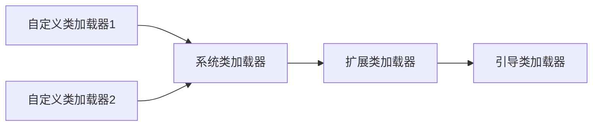

# 类加载器子系统
- [内存结构概述](#一、内存结构概述)
- [类加载器与类加载过程](#二、类加载器与类加载过程)
- [类加载器分类](#三、类加载器分类)
- [ClassLoader的使用说明](#四、ClassLoader的使用说明)
- [双亲委派机制](#五、双亲委派机制)
- [其他](#六、其他)

## 一、内存结构概述
- 简化图  


- 细化图  


### 1. 类加载器子系统  


#### 1.1 整体作用：
- 负责从本地或者网络中加载符合JVM规范的Class文件。开头有特定的文件标识，在链接的验证阶段校验。
- ClassLoader只负责class文件的加载，是否可以运行由执行引擎来决定。
- 加载的类信息放在方法区中。方法区中还会放运行时常量池信息（字符串字面量、数字常量）。

#### 1.2 三个环节
- 加载： 通过类加载器将class文件加载到内存中。分为三类加载器，也可以自定义加载器。
- 链接： 分为验证、准备、解析三个环境。
- 初始化：静态变量的显示初始化。
        
### 2. 运行时数据区
- pc计数器
- 栈（虚拟机栈），每个线程一份，分为栈针、局部变量表、操作栈、动态链接、方法返回地址。
- 本地方法栈
- 堆，存储创建的对象实例，线程间共享，gc主要考虑的空间。
- 方法区，存储类的信息、常量、方法信息等。只有HotSpot虚机才有。

### 3. 执行引擎  
将指令翻译成机器指令，供cpu执行。分为：
- 解释器
- 即时编译器
- 垃圾回收器
    
如果要手写一个JVM，主要需要考虑**类加载器子系统**和**执行引擎**。

## 二、类加载器与类加载过程
- [加载](#2.2.加载)
- [链接](#2.3.链接)
- [初始化](#2.4.初始化)

### 2.1 初步感知


### 2.2.加载
1. 通过一个类的全限定名，获取定义此类的二进制字节流。
2. 将字节流代表的静态存储结构转化为方法区中的运行时数据结构。
3. 在内存中生成一个代表这个类的Class对象，作为方法区这个类的各种数据访问的入口。

#### 2.2.1 加载方式
1. 从本地系统中加载
2. 从网络中加载
3. 从压缩包中加载（第三方jar包）
4. 运行时计算（动态代理技术）
5. 从其他文件生成
6. 从专有数据库中提取
7. 从加密文件中加载（运行时需要解密）

### 2.3.链接
链接分为三个环节：
1. 验证  
验证class文件的字节流中包含的信息符合当前虚拟机的要求，相当于做参数校验，对虚拟机进行保护。  
主要包括四种验证：
    - 文件格式验证
    - 元数据验证
    - 字节码验证
    - 符号引用验证

    例如：class文件都是以CA FE BA BE开头的。

2. 准备  
为类变量分配内存并设置默认初始值（零值），不同数据类型的零值不同。
    ```java
    public class test {
        // a在准备阶段赋值为0，在初始化阶段赋值为1；
        private static int a = 1;
        
        public static void main(String[] args){
            System.out.println(a);
        }
    
    }
    ```

3. 解析

### 2.4.初始化
- 初始化阶段就是执行类构造器方法``<clinit>()``的过程，``<clinit>()``不需要定义，javac编译器自动合并类中所有类变量的赋值动作和静态代码块中的语句。合并顺序取决于语句在源文件中的位置，依次执行。

    ```java
    public class ClinitTest {
        // 任何类声明后，内部至少存在一个构造器
        private int a = 1;
        private static int c = 3;
    
        static{
            c = 5;
        }
    
        public static void main(String[] args) {
            int b = 2;
        }
    
        public ClinitTest() {
            a = 10;
            int d = 20;
        }
    }
    ```
    clinit方法中c先赋值为3，再在静态代码块中赋值为5，按顺序依次执行
    

- 如果类中没有类变量的赋值操作，也没有静态代码块，则不会有``<clinit>()``方法
    ```java
    public class NonClinitTest {
        // 虽然有类变量，但是没有赋值
        public static int num;
    
        public static void main(String[] args) {
            System.out.println(num);
        }
    
        public void add() {
            num++;
        }
    }
    ```
    字节码文件中没有``<clinit>()``
    

    另外从这个例子中可以看到，即使没有显示地定义构造器，编译器也会自动生成一个默认构造器，给变量赋零值。
    

- ``<clinit>()``和构造器不同，构造器有单独的``<init>()``


- 若有父类，JVM须保证子类的``<clinit>()``执行前，父类的``<clinit>()``已经执行完毕

- JVM须保证一个类的``<clinit>()``方法在多线程下被同步加锁，一个类只会被加载一次
    ```java
    public class SynchronizeTest {
        public static void main(String[] args) {
            // 实现runnable接口
            Runnable r = () -> {
                System.out.println(Thread.currentThread().getName() + "start");
                DeadThread deadThread = new DeadThread();
                System.out.println(Thread.currentThread().getName() + "end");
            };
    
            Thread t1 = new Thread(r, "thread-1");
            Thread t2 = new Thread(r, "thread-2");
    
            // 抢到资源的线程开始加载DeadThread后，因为加载会一直进行中，另一个线程永远抢不到锁
            t1.start();
            t2.start();
        }
    }
    
    class DeadThread {
        // 一个永远不会结束的静态代码块
        static {
            // 加if是为了能编译通过
            if (true) {
                System.out.println(Thread.currentThread().getName() + "is initializing DeadThread");
                while (true) {
    
                }
            }
        }
    }
    ```
    输出：
    ```java
    // 线程2抢到了锁开始执行DeadThread的clinit，线程1永远没法拿到DeadThread的clinit
    thread-2start
    thread-1start
    thread-2is initializing DeadThread
    ```
  
## 三、类加载器分类

### 3.1 初步感知
JVM支持两种类加载器：
1. 引导类加载器（Bootstrap ClassLoader）
2. 自定义类加载器（所有派生于抽象类ClassLoader的类加载器），扩展类加载器和系统类加载器在这个分类里。

按上面的分类扩展类加载器和系统类加载器都属于自定义类加载器  


- 对用户自定义的类来说，默认使用系统类加载器来进行加载
- Java核心类库（如``String``），使用引导类加载器加载  
```java
public class ClassLoaderTest {
    public static void main(String[] args) {
        // 获取系统类加载器
        ClassLoader systemClassLoader = ClassLoader.getSystemClassLoader();
        // jdk.internal.loader.ClassLoaders$AppClassLoader@3fee733d
        System.out.println(systemClassLoader);

        // 获取上层加载器：扩展类加载器
        ClassLoader extClassLoader = systemClassLoader.getParent();
        // jdk.internal.loader.ClassLoaders$PlatformClassLoader@10f87f48
        System.out.println(extClassLoader);

        // 获取上层加载器：引导类加载器
        ClassLoader bootStrapClassLoader = extClassLoader.getParent();
        // null
        System.out.println(bootStrapClassLoader);

        // 获取用户自定义类的类加载器：默认使用系统类加载器
        ClassLoader classLoader = ClassLoaderTest.class.getClassLoader();
        // jdk.internal.loader.ClassLoaders$AppClassLoader@3fee733d
        // 和系统类加载器完全一致
        System.out.println(classLoader);

        // 获取String的类加载器：使用引导类加载器
        ClassLoader stringCL = String.class.getClassLoader();
        // null
        System.out.println(stringCL);

    }
}
```

### 3.2 常见类加载器
- 引导类加载器
- 扩展类加载器
- 系统类加载器

#### 3.2.1 引导类加载器(Bootstrap Loader, 启动类加载器)
- 这个类加载使用C/C++实现，嵌套在JVM内部。
- 用来加载**核心类库**（JAVA_HOME/lib/jre等路径下的库），用于提供JVM自身需要的类。
- 不继承ClassLoader，没有父加载器
- 扩展类和系统类加载器也算是核心类库，也是用引导类加载器来加载的。
- 出于安全考虑，只加载包名为**java、javax、sun**等开头的类(双亲委派，防止核心类被篡改)。
```java
// 获取引导类加载器可以加载的类
System.out.println("******引导类加载器******");
URL[] urls = sun.misc.Launcher.getBootstrapClassPath().getURLs();
Arrays.stream(urls).forEach(url -> System.out.println(url.toExternalForm()));
// 任选一个看下类加载器
System.out.println("Provider CL: " + Provider.class.getClassLoader() + "\n");
```

#### 3.2.2 扩展类加载器（Extension ClassLoader）
- 使用Java实现，Launcher$ExtClassLoader
- 继承ClassLoader，父类加载器为引导类加载器
- 用来加载**扩展类**（**jre/lib/ext**目录下的类），自动义的类若放在这个路径下，也是用扩展类加载器来加载的。
```java
System.out.println("******扩展类加载器******");
String extDirs = System.getProperty("java.ext.dirs");
Arrays.stream(extDirs.split(";")).forEach(System.out::println);
// 任选一个看下类加载器
System.out.println("AccessBridge CL: " + AccessBridge.class.getClassLoader() + "\n");
```

#### 3.2.3 系统类加载器（AppClassLoader）
- 使用Java实现，Launcher$AppClassLoader
- 继承ClassLoader，父类加载器为扩展类加载器
- 加载环境变量``classpath``或系统属性``java.class.path``指定路径下的类
- 默认的类加载器
- 通过``ClassLoader$getSystemClassLoader()``方法来获取该类加载器

#### 3.2.4 自定义类加载器
- 类的加载几乎由上面三种加载器配合执行的，也可以自定义类加载器
- 为什么要自定义类加载器？ 
  - 隔离加载类，不同的中间件可能路径和类名相同。
  - 修改类加载的方式
  - 扩展加载源
  - 防止源码泄露
- 自定义类加载器的步骤
  - 继承java.lang.ClassLoader，重写findClass
  - 继承URLClassLoader，可以避免重写findClass，避免读取字节码文件

## 四、ClassLoader的使用说明

## 五、双亲委派机制
Java加载class文件是按需加载的，使用时才加载到内存中生成class对象。
需要加载时，Java采用双亲委派模式来加载类的clas文件。即把请求交由父类处理，这是一种任务委派模式。


示例：为什么要使用双亲委派机制
1. 若代码中定义了一个类，路径是java.lang.String。在调用String类的时候用的还是原来的String类，防止核心类库被恶意覆盖加载导致项目崩了。

### 5.1 工作原理
- 如果一个类加载器收到了类加载请求，它不会自己先去加载，而是委托给父类去加载。
- 父类还有父类就继续向上委托，直到顶层的启动类加载器。
- 父类可以完成加载就返回加载结果，父类不能加载就子类尝试去加载。

【问题】jdbc.jar下某个接口如SPI接口的实现类是怎么加载的？
【ans】先加载SPI接口，它是rt.jar中的核心类，由引导类加载器加载，再加载具体的实现类，引导类加载器无法加载，反向委托交给ContextClassLoader(线程上下文加载器)来加载，具体使用的是系统类加载器。

### 5.2 优势
- 避免类重复加载
- 保护程序安全，防止核心API被随意篡改

### 5.3 沙箱安全机制
加载核心类库的类会有限加载jdk自带的文件，而不是用户定义的类。可以保护java的核心源码。

## 六、其他
- Jvm中两个class对象是同一个类的必要条件：
  1. 类的完整包名一直
  2. 类的加载器相同

  ps：即使两个类对象来源于同一个class文件，如果最终jvm使用的类加载器不同，则这两个类对象不同。

- jvm必须知道一个类是由引导类加载器还是其他类加载器（扩展、系统、自定义，统称用户类加载器）加载的。 
  1. 如果是由用户类加载器加载的，那么jvm会将这个**类加载器的引用**作为**类型信息的一部分**保存在**方法区**中。
  2. 当解析一个类型到另一个类型的引用时，jvm需要保证这两个类型的类加载器时相同的。（如动态链接）

### 6.1 类的主动使用与被动使用
- 两者的区别：是否会导致类的初始化。 主动使用会，被动使用不会（会加载和链接）。
- 主动使用的场景：
  1. 创建类的实例
  2. 访问类或接口的静态变量，或对其赋值
  3. 调用类的静态方法
  4. 反射
  5. 初始化一个类的子类
  6. **java虚拟机启动时被标明为启动类的类**[todo]
  7. **jdk 7开始提供的动态语言支持**[todo]